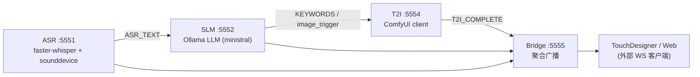

# Co Steam v1 技术文档

本项目是多模态微服务流水线，包含 ASR（语音转文字）、SLM（意图/关键词）、T2I（图生图）、Bridge（消息中枢），便于 TouchDesigner/Web 订阅。下文提供架构、依赖、运行指南和自测方法。

## 架构概览



消息协议：`common/protocol.py` 定义 `Message`（type/source/data/id/timestamp）与 `MessageType`（ASR_TEXT、KEYWORDS、T2I_COMPLETE 等），`PORTS` 为默认端口。

## 目录与组件

- `asr/`：实时 ASR（faster-whisper），`service.py` 支持设备交互选择/索引，`--list-devices` 可查看音频输入。
- `slm/`：意图/关键词/图像触发（调用 Ollama），`inference.py` 使用 `ministral-3:3b-instruct-2512-q4_K_M`。
- `t2i/`：ComfyUI 客户端，`service.py` 连接 8188 提交 workflow（`t2i/workflows/sd15_fast.json`），保存到 `data/generated_images`。
- `bridge/`：中枢，转发 ASR/SLM/T2I 到外部 WS 客户端，同时接受 CONFIG_UPDATE/PING。
- `common/`：WS 基类、协议常量。
- `start_*.bat`：Windows 启动脚本；`run_services.bat` 依次启动全链路。
- 大文件已忽略：`ComfyUI_cu126/`、`models/`、`ollama-models.tar.gz`、`data/`、`snapshots/` 等。

## 运行时依赖

- Python 3.10（asr 环境），`pip install -r requirements.txt`。
- Ollama 服务（默认 `http://localhost:11434`），模型：`ministral-3:3b-instruct-2512-q4_K_M`。
- ComfyUI 便携包（放在仓库根，默认路径 `ComfyUI_cu126/ComfyUI_windows_portable`），SD1.5 checkpoint 需命名为 `v1-5-pruned-emaonly.safetensors` 置于 `ComfyUI/models/checkpoints/`。
- 可选：风格适配器 `t2iadapter_style_sd14v1.pth` 放在 `ComfyUI/models/t2iadapter/`，否则自动退回 fast 工作流。
- 音频设备：若需环回，可用 Stereo Mix 或虚拟声卡；`--device-index` 可直接指定。

### GPU 兼容性提示

当前便携包内置的 PyTorch CUDA 版本不支持 RTX 50 系列 (sm_120)。可用 CPU 方案：
```cmd
cd /d D:\co_steam_v1\ComfyUI_cu126\ComfyUI_windows_portable
python_embeded\python.exe -m pip uninstall -y torch torchvision torchaudio
python_embeded\python.exe -m pip install --index-url https://download.pytorch.org/whl/cpu torch torchvision torchaudio
```
启动时加 `set COMMANDLINE_ARGS=--cpu` 再运行 `start_comfyui.bat`。

## 快速开始（Windows）

1. 克隆 & 环境
```cmd
git clone git@github.com:FuugaMo/co_steam_v1.git D:\co_steam_v1
cd /d D:\co_steam_v1
conda create -n asr python=3.10 -y  (或 venv)
conda activate asr
pip install -r requirements.txt
```
2. 放置大文件
   - `ComfyUI_cu126/ComfyUI_windows_portable` 整包放仓库根。
   - SD1.5 checkpoint 重命名为 `v1-5-pruned-emaonly.safetensors` 放入 `ComfyUI/models/checkpoints/`。
   - faster-whisper 权重放 `models/faster-whisper-small`（默认路径在 ASR 启动参数）。
   - Ollama 模型：`ollama pull ministral-3:3b-instruct-2512-q4_K_M`（确保 `ollama list` 可见）。
3. 启动 ComfyUI（CPU 示例）
```cmd
cd /d D:\co_steam_v1
set COMMANDLINE_ARGS=--cpu
start_comfyui.bat   :: 浏览器访问 http://127.0.0.1:8188
```
4. 启动全链路
```cmd
cd /d D:\co_steam_v1
set CONDA_BAT=C:\Users\<you>\Miniconda3\condabin\conda.bat  (按需)
run_services.bat
```
   或单独：
```cmd
python asr\service.py --device-index 2
python slm\service.py --port 5552
python t2i\service.py --port 5554 --comfyui-url http://127.0.0.1:8188
python bridge\service.py --port 5555
```

## 自测命令

- SLM 直测（需 Ollama 11434 正常）：
```cmd
python -c "from slm.inference import route; print(route('explain photosynthesis', last_image_keywords=['plants','light']))"
```
- T2I 直测（需 ComfyUI 正常，已放 SD1.5 权重）：
```cmd
python -c "from argparse import Namespace; from t2i.service import T2IService; \
args=Namespace(port=5554, slm_host='localhost', comfyui_url='http://127.0.0.1:8188', \
workflow='sd15_fast', output_dir='D:/co_steam_v1/data/generated_images', version_tag='cli-test', \
style='', staff_suffix='', staff_negative='', vram_mode='8gb'); \
svc=T2IService(args); res=svc.generate_image('cli-test', ['photosynthesis','diagram'], {'original_text':'photosynthesis diagram', 'topic_score':0.9}); print(res)"
dir D:\co_steam_v1\data\generated_images\cli-test.*
```
- ASR 设备查看/选择：
```cmd
python asr\service.py --list-devices          :: 仅列设备
python asr\service.py                         :: 交互选择索引
python asr\service.py --device-index 2        :: 直接指定
```

## 常见问题

- **Ollama 连接失败**：11434 未启动或模型缺失，先 `ollama serve`（如已为服务可忽略）、`ollama pull ministral-3:3b-instruct-2512-q4_K_M`。
- **T2I 报 checkpoint 缺失**：确保 `v1-5-pruned-emaonly.safetensors` 存在于 `ComfyUI/models/checkpoints/`。
- **CUDA 不兼容 (sm_120)**：使用 CPU 版 torch 并 `set COMMANDLINE_ARGS=--cpu`。
- **音频环回无声**：启用 Stereo Mix 并设为默认录音，或使用 VB-Cable 等虚拟声卡，将输出路由到虚拟输入后在 ASR 用 `--device-index` 选择。
- **端口占用**：ASR/SLM/T2I/Bridge 默认 5551-5555，可在各 `start_*.bat` 或启动参数中调整。

## 变更记录（文档）
- 2026-01-09：新增 `TECH_DOC.md`，梳理架构、依赖、运行与自测方法。
